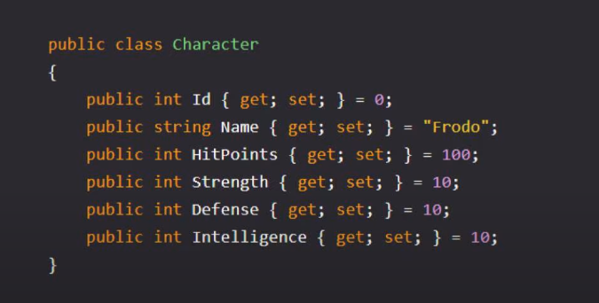
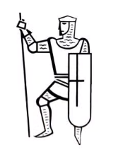
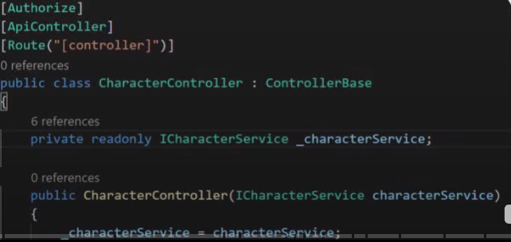
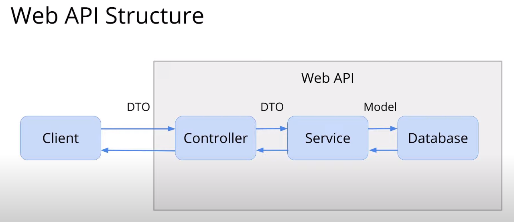

## Curso C# Udemy - WebServers e API's

### **1. Endereço IP**

Como os computadores ao redor do mundo se conectam?  
Através do endereço IP conectado á internet.

### **2. Acesso à páginas da internet**

DNS = possui uma tabela gigante que traduz o nome do site para seu endereço IP, ele responde a solicitação com o endereço IP requerido.

Com esse endereço IP, o computador solicita acesso ao servidor web e é retornado o conteúdo da página.  

Servidor Web = "armazena" os dados da página web.

Porta usada: 80.

www.google.com == http://www.google.com:80/  

### **3. Socket**

Permite a comunicação entre dois processos diferentes, localizados na mesma máquina ou máquinas diferentes que estão na mesma rede.
São identificados através de um endereço IP e uma porta.

TCP = garantia da mensagem;  
UDP = não garante o recebimento da mensagem;  

### **4. Serviços windows**

Executáveis em console, e o próprio windows inicializa o serviço.

### **5. Model View Controller(MVC)**

Model = definição dos dados;  

View = representação dos dados (UX/UI);  

  

Controller = o funcionamento da aplicação;  

  

### **6. Web API Estrutura**

  